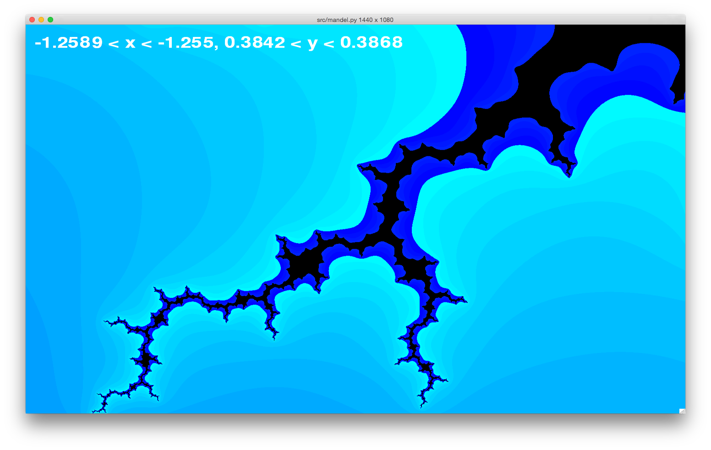

# マンデルブロ集合


## Requirements

* Python 3.4
* Numpy
* Pygame
* Cython

各位自分の環境に適当にインストールしてください.

## セットアップ方法の例

```
$ git clone https://github.com/jtwp470/mandelbrot-set.git
$ cd mandelbrot-set
$ virtualenv ./ --python=/usr/local/bin/python3
$ source ./bin/activate
$ pip install -r requirements.txt
$ cd src
$ python3 setup.py build_ext --inplace
$ python3 mandel.py
```

しかしPygameをインストール出来ない場合は次のようにしてください.

```
$ pip3 install hg+http://bitbucket.org/pygame/pygame
```

またOSXではvirtualenv環境で使おうとすると何故か上手く動かないので面倒ですが普通にpipで入れてください.
## 使い方, キーボードショートカット

### 高さと幅の設定
起動時にオプションの指定により高さと幅をそれぞれ指定できます.

例:1920 x 1080

```
$ python3 mandel.py --width 1920 --height 1080
```

なおこの引数は省略可能で省略した場合は720x480の大きさで描画されます.

### 描画範囲の設定
オプションに```--minx, --maxx, --miny, --maxy```というものがあり各描画範囲をx, yの範囲で設定することができます.

キーボードショートカット:

|キーボードショートカット|機能の説明|
|------------------------|----------|
|<kbd>i</kbd>|拡大|
|<kbd>o</kbd>|縮小|
|<kbd>l</kbd>|右へ移動|
|<kbd>h</kbd>|左へ移動|
|<kbd>k</kbd>|上へ移動|
|<kbd>j</kbd>|下へ移動|
|<kbd>s</kbd>|画面を保存|
|<kbd>q</kbd>|プログラムを終了|

## さらなる高速描画のために
さらなる高速描画を求めてついにCythonに手を出してしまいました.

例はCython Wikiの[Optimizing Cython for Mandelbrot fractal calculations](https://github.com/cython/cython/wiki/examples-mandelbrot)
のコードを参考にしました.

主にマンデルブロ集合に属しているかどうかを判定する部分で時間がかかるのでそこをCythonで書きなおしてみました.少し早くなったと思う.

* 高速化例

|種別|大体の時間(秒)|
|----|----------|
|Pure Python|2.5|
|Python + Cython|0.7|


## 実行例
